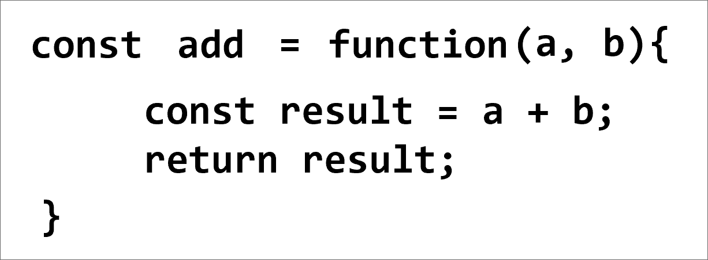
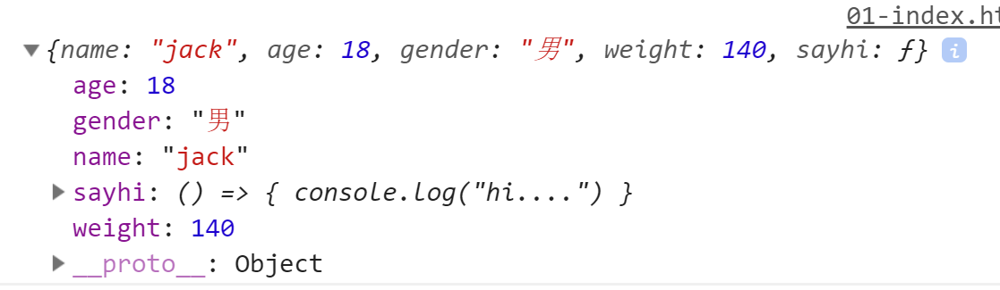
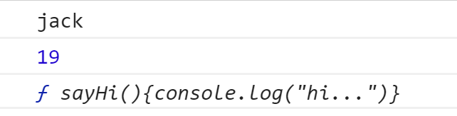
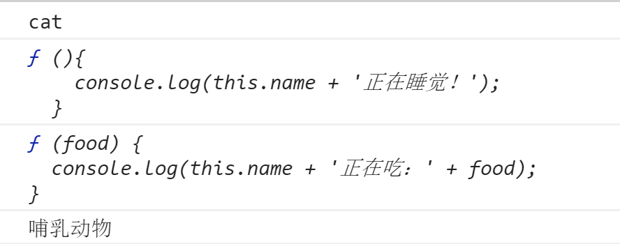
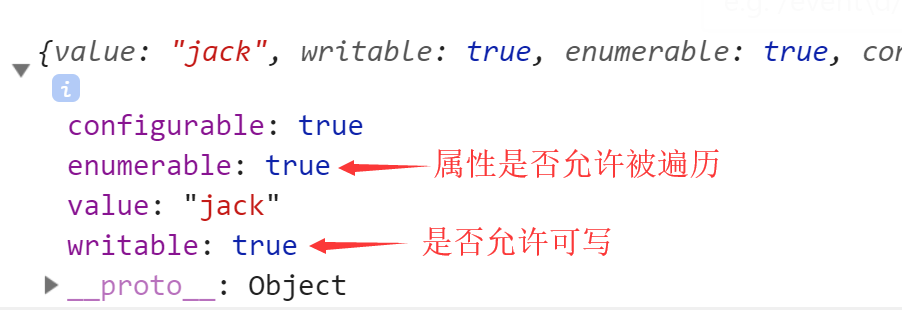
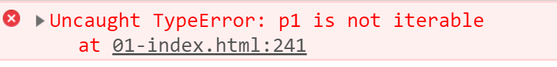

#  ES6 简要教程
## 01.  ES6简介

### 1.1 什么是ES6

​	ES6其实就是在ES5的基础之上新增了一些语法和提供多了一些api, 使用ES6新增的语法和api, 我们可以快速实现一些功能，而不必使用ES5中写很多代码的方式来实现。比如我要判断1个字符串是否以指定的字符串开始，在ES6中，直接为字符串对象新增了1个方法`startsWtih`就可以轻松的实现这个功能。

```javascript
var str = "heima good"; 
var res = str.startsWith("hei"); //判断字符串str是否以hei开头
//res就是1个bool值，代表str是否以"hei"开头
```

​	ES6就是这么高效，为JavaScripter提供了快速高效的编码方式.

### 1.2 ES6的兼容性

​	ES6标准于2015年6月正式发布, 经过四年的发展，PC桌面端的主流浏览器最新版本都对ES6实现了最大化的兼容，移动端浏览器基本上实现了对ES6的兼容，NodeJS对ES6绝大部分语法进行了实现。

​	ES6兼容情况一览表：  [传送门](<http://kangax.github.io/compat-table/es6/>)

​	对于少部分语法不兼容的情况(主要是PC桌面端浏览器), 我们可以使用编译器(如Babel)将我们写的ES6代码转换为ES5的代码，以便让低版本的浏览器可以兼容。具体如何使用Babel，我们将在后续的章节为大家介绍。

## 02. let与const

### 2.1 他们是什么？

​	`let`与`const`是ES6新增的两个关键字，他们的作用和`var`的作用一样，是用来声明变量的

```javascript
var a = 1;
let b = 2;
const c = "i love heima";
```

### 2.2 let与const的区别

​	使用`let`声明的变量，后续可以重新为其赋值；使用`const`声明的变量，要求在声明的同时就进行初始化，但是后续无法再为这个变量进行重新赋值。

```javascript
let a = 10;
a = 20;
let b;
b = "jack";
const c = 10;
c = 20; //错误，c是const声明的，变量不能再重新赋值
const d; //错误，使用const声明的变量，必须在声明的同时就初始化.
```

**特别注意**，`const`变量指向1个对象的时候，这个变量的值不能变，但是这个变量指向的对象可以修改.

```javascript
const person = {
    name: "jack",
    age: 19,
    gender: "male"
};
person.name = "rose"; //可以，并没有修改person变量的值，修改的是person指向的对象的属性的值.
person = {
    name: "rose",
    age: 18,
    gender: "female"
}; //错误，person变量是被const修饰的，不能再为其赋值.

```

### 2.3 与var的区别

使用`let`和`const`声明的变量不存在变量提升，有自己的作用域 - 其所在的大括弧中。

```javascript
let a = 1;
{
    let b = 2;
    console.log(c);//报错，提示变量c未定义
    const c = 3;
    //变量b、c只能在声明b、c变量中的大括弧中访问。 
    //并且也不存在变量提升
    console.log(a); //可以访问
    console.log(b);//可以访问
    console.log(c); //可以访问
}
console.log(a); //可以访问
console.log(b);//不可以访问
console.log(c); //不可以访问`
```

### 2.4 使用建议

* 能使用const就不要使用let
* 能使用let就不要使用var

​       其实大多数情况下，我们声明的变量后续都不会再重新赋值，所以这种情况，建议使用`const`；如果变量的值后续需要更改，可以使用`let`； `var`关键字请彻底废弃。

## 03. 箭头函数

​	箭头函数是我们之前学习的函数的一种简写方式。

### 3.1 箭头函数的书写规则

​	将普通函数的`function`关键字删掉， 在小括弧与大括弧中间加上1个箭头`=>`，用法与普通函数一样。

```javascript
const add = function (a, b){
    const result = a + b;
    return result;
}

const sayHi = (a, b) => {
    const result = a + b;
    return result;
}
```

  

箭头函数的作用：  让我们声明函数的时候，使用更少的代码，看起来更简洁。


### 3.2 更简洁的写法

 * a. 如果参数只有1个，那么包围参数的小括弧可以省略

```javascript
const isEven = num => {
    if(num % 2 == 0){
        return true;
    }else{
        return false
    }
}
```

   

 * b. 如果函数体只有一句代码，那么包围函数体的大括弧可以省略,并且这句代码的结果会自动作为返回值返回

```javascript
const isEven = num => num % 2 == 0;
const res = isEven(10);
```


### 3.3 箭头函数的使用场景

* 箭头函数本身是1个匿名函数，所以如果你要二次使用，必须得有个变量保存起来.
* 箭头函数在回调函数中被经常使用到，代码会显得更简洁。

```javascript
setTimeout(()=>console.log(1),1000);
```

### 3.4 箭头函数使用注意

* 函数体内的`this`对象，就是定义时所在的对象，而不是使用时所在的对象。
* 不可以使用`arguments`对象，该对象在函数体内不存在。如果要用，可以用 rest 参数代替。

## 04. 字符串

### 4.1 模板字符串

​	声明字符串我们可以使用单引号和双引号来表示，在ES6中新增了一种声明方式，使用1对撇号来表示。

```javascript
let msg = `大家好，
我是小明
\n哈哈，你好啊
这是1个模板字符串哦
`;
```

* 模板字符串，支持换行，等操作，撇号中的内容会被原样识别。

* 模板字符串还支持变量替换

```javascript
let name1 = "杜子腾";
let name2 = "秦寿生";
let msg = `孔子东游，见两小儿辩斗，问其故。
${name1}曰：“我以日始出时去人近，而日中时远也。”
${name2}以日初出远，而日中时近也。
${name1}曰：“日初出大如车盖，及日中则如盘盂，此不为远者小而近者大乎？”
${name2}曰：“日初出沧沧凉凉，及其日中如探汤，此不为近者热而远者凉乎？”
孔子不能决也。
${name1+"和"+name2}笑曰：“孰为汝多知乎？”
`;
```


### 4.2 字符串新增方法

* `includes()`方法              是否包含子串
* `startsWith()`方法          以指定的串开始
* `endsWith()`方法             以指定的串结尾
* `repeat()`方法                将字符串重复
* `padStart()`方法            头部补全
* `padEnd()`方法                尾部补全

## 05. 数值Number

> ES6为Number新增了一些方法，方便我们更加方便操作Number数据.

* `Number.isFinite()` 用来检查一个数值是否为有限的（finite），即不是`Infinity`
* `Number.isNaN()`  用来检查一个值是否为`NaN`
* es6将全局方法`parseInt()`和`parseFloat()`，移植到`Number`对象上面，行为完全保持不变
* `Number.isInteger()` 用来判断一个数值是否为整数。


## 06. Math类

ES6对Math对象新增了很多数学方法.  [传送门](http://es6.ruanyifeng.com/#docs/number#Math-%E5%AF%B9%E8%B1%A1%E7%9A%84%E6%89%A9%E5%B1%95)

并且新增了1个算术运算符 - 指数运算符 （ ** ）

```javascript
const a = 2;
const b = 3;
const c = 2 ** 3;  //2的3次方.
```


## 07. 函数

### 7.1 参数默认值

​	在声明函数的时候，允许对函数的参数赋一个默认值， 当调用函数时，如果不为指定默认值的参数传值，那么在函数执行的时候，参数的值就是默认值

```javascript
const add = (a, b = 20) => {
    const res = a + b;
    console.log(res);
}
add(10);//在调用函数的时候，只为第1个参数传值，而没有为第2个参数传值。那么第2个参数的值就是其默认值20
add(10, 5);//如果两个参数都传了值，那么参数的值就是传入的值。
```

​	需要注意的是， 如果函数的参数带了默认值，那么带了默认值的参数必须写在参数列表的最后

```javascript
const add = (a = 10, b) => { //报错，带默认值的参数必须放在参数列表的最后.
    
}
```

​	这样，别人在调用我们写的函数的时候，一眼就能看出哪些参数是必传参数，哪些参数是可选参数。

### 7.2 参数是1个对象的时候

​	当1个函数的参数是1个对象的时候，按照我们之前的写法，调用者很难知道这个对象的属性有哪些。比如，jQuery的ajax方法，这个方法我们都知道要传入1个对象，但是这个对象要准备哪些属性呢？ 除了看文档，真的没有别的方法。在ES6中，为我们提供了一种写法，让调用者看到我们函数的形参就知道要传入哪些属性，代码演示如下

```javascript
//参数直接使用1个大括弧围起来，把属性写在其中. 这就表示参数是1个对象，这个对象中有这么些属性
const ajax = ({url, method, data}) =>{ 
    console.log(url, method, data)      
}

ajax({
    url: "aa",
    method: "get",
    data: {
        name: "jack",
        age: 18
    }
});

```

### 7.3 rest参数(可变参数)

​	当我们需要某1个函数可以接收任意多个参数的时候，我们之前的做法要么是使用arguments，要么是使用1个数组，在ES6中，借鉴了其它语言中非常流行的一种做法，那就是rest参数.

​	当形参前面加上`...` 三个点， 就表示这是1个rest参数，这是1个数组，它可以接收多余的实参到这个数组中。

```javascript
const add = (a, b, ...args) => { //args就是1个rest参数，它是1个数组，用来存储传入的额外参数.
    let sum = a + b;
    for(let index in args){
        sum += args[index];
    }
    console.log(sum);
}
add(1, 2, 3, 4, 5, 6, 7, 8);  //1和2分别传给了参数a和b, 后面的所有参数都传给了args数组.
```

​	**需要注意的是，rest参数只能放在参数列表的最后，并且1个函数最多只能有1个rest参数**


### 7.4 函数参数的尾逗号

​	在ES6中，允许在参数列表的最后也加上1个逗号，用来让我们的代码变的可读性更高。

```javascript
const add = (a, b, c,) => {
    return a + b + c;
}

add(10,20,30,);
```

## 08. 数组

### 8.1 扩展运算符

​	其实叫做`展开运算符`更容易理解一些，它可以将1个数组中的元素展开, 一般用在函数的传参中。

```javascript
const add = (a, b, c) => {
    return a + b + c;
}
const arr = [10, 20, 30];
add(...arr); //将数组arr展开成单独的10,20,30，传给add函数
```


### 8.2 常用扩展方法

* `includes()`， 判断数组中是否包含指定的元素

* `flat()`, 当数组中包含1个数组时，可以将里面的数组拉平，变成1个一维数组。参数代表拉平的层数。`Infinity`

  

  其它方法扩展。 [传送门](<http://es6.ruanyifeng.com/#docs/array>)


## 09. 对象

### 9.1 属性简洁表示法

​	声明对象的时候，如果属性名和属性值都是一样的变量，可以使用简写的形式，代码演示如下。

```javascript
ES5写法:
var name = "jack";
var age = 19;
var gender = "男";

var person = {
    name: name,
    age: age,
    gender: gender,
    sayHi: function(){
        console.log("你好，hi...");
    }
}

ES6简写形式
const name = "jack";
const age = 19;
const gender = "男";

const person = {
    name,
    age,
    gender, //如果属性名，和属性的值使用的是同1个变量，可以这样简写
    sayHi(){
        console.log("你好，hi...");
    }//对象方法也可以简写.
}

```

### 9.2 属性名表达式

在ES5中，要为对象新增1个属性，可以使用这样的代码

```javascript
const p1 = {
    name: "jack",
    age: 18
}
p1.gender = "男";
p1["weight"] = 140;
```

在ES6中，为对象新增属性，属性可以使用表达式，像下面这样

```javascript
const p1 = {
    name: "jack",
    age: 18
}
p1["gen"+"der"] = "男";
p1["wei"+"ght"] = 140;
p1["say"+"hi"] = () => { console.log("hi....") }
```

最终对象是这样的，属性名可以使用拼接。

 


### 9.3 属性的可枚举

#### 引入

​	`for in`可以遍历对象的属性包括方法

```javascript
const p1 = {
    name: "jack",
    age: 19,
    sayHi(){console.log("hi...")}
}
for(let key in p1){
    console.log(p1[key]);
}
```

结果如下

 

但是，你有没有想过一个问题，p1对象中只有这些成员吗？还有从父类继承过来的`toString`方法没有被遍历出来，是继承的属性不能被遍历吗？ 用代码证实一下
```javascript
function Animal (name) {
  this.name = name || 'Animal';
  this.sleep = function(){
    console.log(this.name + '正在睡觉！');
  }
}
Animal.prototype.eat = function(food) {
  console.log(this.name + '正在吃：' + food);
};
Animal.prototype.type = "哺乳动物";

function Cat(){

}
Cat.prototype = new Animal();
Cat.prototype.name = "cat"

var c1 = new Cat();
for(let key in c1){
    console.log(c1[key]);
}//证实父类的属性可以被遍历.
```

证实父类的属性可以被遍历

 

那究竟什么样的属性才可以被遍历呢？

####  属性描述对象

> 对象的每一个属性，其实都有1个描述对象，这个描述对象来保存这个属性的描述信息(是否能被遍历，是否可读，默认值...)。 使用 *Object.getOwnPropertyDescriptor()*方法可以获取对象的属性的描述方法. 

```javascript
const p1 = {
    name: "jack",
    age: 19,
    sayHi(){ console.log("hi..."); }
}
const desc = Object.getOwnPropertyDescriptor(p1, "name"); //获取p1对象的name属性的描述对象
```

属性描述对象描述这个属性的信息如下。

 

​	只有当属性的描述对象的`enumerable`值为`true`的时候，这个属性才会被允许遍历。

​	那属性的描述对象的`enumerable`值什么时候才有可能为`false`呢?

​	当我们使用`Object.getOwnPropertyDescriptor()` 为对象定义属性的时候，可以指定描述对象的`enumerable`的值

```javascript
const p1 = {
    name: "jack",
    age: 19,
    sayHi(){ console.log("hi..."); }
}
//参数1  要设定属性的对象
//参数2  要设定的属性的名
//参数3  描述对象
Object.defineProperty(p1, "gender", {
    enumerable: false,
    value: "男"
});
```

​	此时，新增的属性就不能被`for in`遍历了.


#### 属性遍历

#####  `for in` 遍历对象

​	循环遍历对象自身的和继承的可枚举属性

#####  `Object.keys(obj)` 

​	返回一个数组，包括对象自身的（不含继承的）所有可枚举属性的键名。

##### `Object.getOwnPropertyNames(obj)` 

​	返回一个数组，包含对象自身的所有属性（包括不可枚举属性）的键名。


## 10. set

> Set是1个类似于数组的数据结构，与数组不同的是，Set中的数据不允许重复，当向Set中添加1个已经存在的数据时，不会成功。

```javascript
const set = new Set();
set.add(1);
set.add(2);
set.add(3);
set.add(2);//不会添加成功，但是不会报错
```

常用方法

* `size`属性返回set中数据的个数
* `add()`
* `delete()`
* `has()`
* `clear()`

遍历操作

* `keys()`
* `values()`
* `entries()`
* `forEach()`

### WeakSet

> WeakSet和Set一样，都是存储不可重复的数据，与Set的区别有两点
>
> 1.  WeakSet中只能存储对象.
> 2.  WeakSet中存储的对象都是弱引用，当外部没有变量指向对象的时候，即使被WeakSet所引用，对象也会被回收。


## 11. Map

> 键值对存储数据，和js中的对象类似，不同的是，js对象中的键只能是字符串，而map中的键可以是任意类型.

```javascript
const map = new Map();
const p1 = { name: "jack" }
const p2 = { name: "rose" }
map.set(p1, p2); //以p1为键，将p2存储到Map对象中.
```

### 常用方法

* `size`属性 获取Map中键值对的个数
* `set(key, value)` 添加键值对， `key`和`value`可以是任意的类型. 该方法返回当前Map对象.
*  `get()`根据键获取键对应的值、
*  `has(key)`
*  `delete(key)` 
*  `clear()` 
*  `keys()`
*  `values()`
*  `entries()`
*  `foreach()`


### WeakMap

> 与Map类似，WeakMap也是用来存储键值对的集合，与Map的区别有两点
>
> 1.  WeakMap只接受对象作为键名(null除外)
> 2. 其次，`WeakMap`的键名所指向的对象，不计入垃圾回收机制。


## 12. 迭代器

在ES6中新增了一种遍历方式叫做`for...of`，可以使用它来遍历数组、Map、Set等.

```javascript
const arr = [10,20,30,40,50,60,70,80,90,100];
for(let item of arr){
    console.log(item);
}

const set = new Set(arr);
for(let item of set){
    console.log(item);
}

const map = new Map();
map.set("name", "jack");
map.set("age", 19);
map.set("gender", "男");

for(let item of map){
    console.log(item);
}
```

能否使用`for...of`循环遍历我们自己写的对象吗？

```javascript
const p1 = {
    name: "jack",
    age: 19,
    gender: "男"
}

for(let item of p1){
    console.log(item);
} //报错 无法使用for of遍历p1对象.
```

 

### 12.1 for...of的原理

​	在使用`for..of`遍历1个对象的时候，先调用这个对象的`Symbol.iterator`方法，这个方法返回1个`迭代器`。每遍历一次，就会调用`迭代器`对象的`next`方法，这个方法会返回1个对象，这个对象包含两个属性，一个是`value`,指定本次遍历得到的结果，还有一个属性是`done`，bool值，代表遍历是否结束，每调用一次`next`方法， 就返回下1个被遍历的值，直到最后一个元素。

```javascript
const arr = [10,20,30,40,50,60,70,80,90,100];
const set = new Set(arr);
//1.调用set对象的遍历器方法，返回1个迭代器对象.  
const iterator = set[Symbol.iterator]();
//iterator就是这个迭代器对象.
while(true){
    let item = iterator.next();
    if(item.done){
		break;
    }
    console.log(item.value);
}
```


### 12.2 实现自己的迭代器

知道了`for...of`的原理后， 如果我们希望我们自己的对象也能被`for...of`遍历，那么就可以这么做

*  为对象添加1个`[Symbol.iterator]`方法。
*  这个方法返回1个对象
*  这个对象需要有1个next方法
*  这个next方法返回1个对象，对象包含`vulue`属性，表示本次遍历的值，包含1个`done`属性，表示本次遍历结束后是否还有数据。 然后保证下次调用next方法的时候 返回的是下1个数据.

```javascript
const hmSet = {
    data: [10,20,30,40,50,60,70,80,90,100],
    [Symbol.iterator](){
        const that = this;
        let index = 0;
        return {
            next: function(){
                return {
                    value: that.data[index++],
                    done: index == that.data.lenght + 1
                }
            }
        }
    }
}

for(let item of hmSet){
    console.log(item);
}
```


### 12.3 原生实现了迭代器的对象

- Array
- Map
- Set
- String
- TypedArray
- 函数的 arguments 对象
- NodeList 对象

也就是说，这些对象是可以直接用`for...of`来遍历的。


